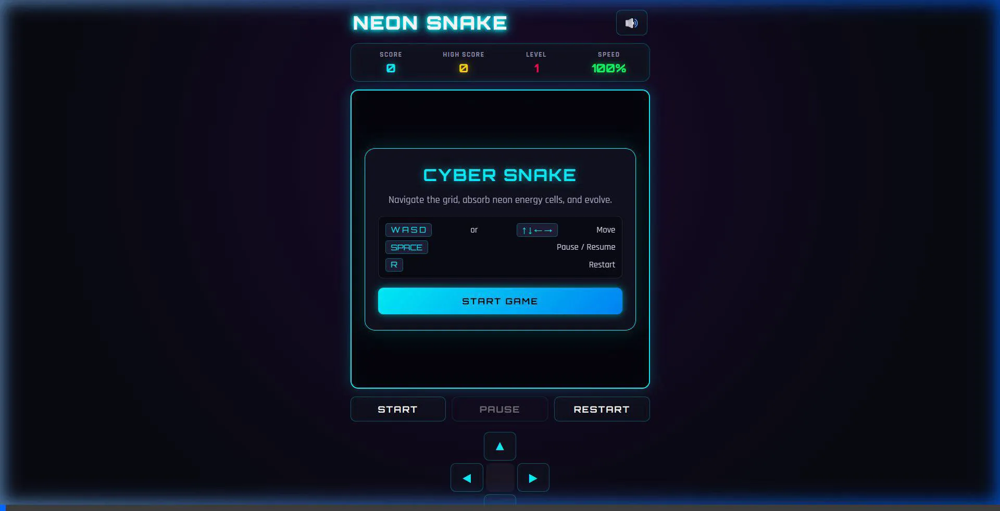

# 🤖 Multi-Agent AI Studio Orchestrator

> **An agentic AI system that coordinates 14 specialized AI agents across a 9-phase production workflow to transform a high-level game concept into a structured, validated development plan.**

[](https://www.python.org/)
[](https://google.github.io/adk-docs/)
[](https://ai.google.dev/)
[](https://modelcontextprotocol.io/)

---

## 🎬 Demo Showcase

> **From Prompt to Playable Game in Seconds:** Experience how the Multi-Agent AI Studio coordinates specialized agents to transform a prompt into a complete, polished, playable game with cyberpunk aesthetics, Web Audio API sound synthesis, responsive controls, and particle physics.

<p align="center">
  
</p>

> 🕹️ **Try the Generated Game:** Open [`snake_game/index.html`](snake_game/index.html) in any web browser to play locally with zero dependencies!

---

## 🎯 Overview

**Multi-Agent AI Studio Orchestrator** is an agentic AI application designed to simulate the collaboration of a multidisciplinary game-development team.

Instead of asking a single LLM to solve an entire problem, the system decomposes the workflow into **specialized roles**, assigns each responsibility to an AI agent, orchestrates dependencies between agents, validates generated artifacts, and passes approved outputs to downstream stages.

### The core idea

```text
                    GAME CONCEPT
                         │
                         ▼
              ┌────────────────────┐
              │   Orchestrator     │
              └─────────┬──────────┘
                        │
           ┌────────────┼────────────┐
           ▼            ▼            ▼
       Design       Gameplay       AI
       Agents        Agents       Agents
           │            │            │
           └────────────┼────────────┘
                        ▼
                 Player Experience
                        │
                        ▼
                Infrastructure
                        │
                        ▼
                    Testing
                        │
                        ▼
                   Debugging
                        │
                        ▼
                  Optimization
                        │
                        ▼
                  Live Operations
                        │
                        ▼
              VALIDATED PRODUCTION PLAN
```

The project demonstrates how **LLM-based agents can be composed into a dependency-aware workflow rather than being used as isolated chatbots.**

---

# 💡 Problem

Complex software and game-production workflows involve multiple disciplines.

A single AI assistant can generate ideas, but it struggles to reliably represent the responsibilities, dependencies, validation requirements, and handoffs that exist between specialized roles.

For example:

```text
Game Design
     ↓
System Architecture
     ↓
Gameplay Logic
     ↓
AI Behavior
     ↓
Level Design
     ↓
Networking
     ↓
Testing
     ↓
Optimization
```

If each stage is generated independently, downstream agents may receive incomplete, contradictory, or unusable information.

### This project addresses that problem through:

- **Role specialization**
- **Phase-based orchestration**
- **Structured artifact passing**
- **Validation checkpoints**
- **Dependency-gated sequential execution**
- **Optional filesystem tools through MCP**
- **Downstream dependency awareness**

---

# 🧠 Solution

The system models a virtual production team consisting of **14 specialized AI agents** distributed across **9 workflow phases**.

Each agent has a defined responsibility and produces an output that can be consumed by other agents.

### Agent lifecycle

```text
Receive Context
      │
      ▼
Analyze Responsibility
      │
      ▼
Generate Artifact
      │
      ▼
Validate Output
      │
 ┌────┴────┐
 │         │
PASS      FAIL
 │         │
 ▼         ▼
Next      Retry /
Stage     Correction
```

This architecture makes the system closer to an **agentic workflow engine** than a conventional LLM application.

---

# 🏗️ System Architecture

```text
┌──────────────────────────────────────────────────────────────┐
│                         USER INPUT                           │
│                    Game / Product Concept                    │
└─────────────────────────────┬────────────────────────────────┘
                              │
                              ▼
┌──────────────────────────────────────────────────────────────┐
│                       ORCHESTRATOR                           │
│                                                              │
│  • Phase management                                          │
│  • Agent coordination                                        │
│  • Context propagation                                       │
│  • Execution control                                         │
└─────────────────────────────┬────────────────────────────────┘
                              │
                              ▼
                 ┌──────────────────────┐
                 │     DESIGN PHASE     │
                 │                      │
                 │ Game Designer        │
                 │ System Architect     │
                 └──────────┬───────────┘
                            │
                            ▼
                 ┌──────────────────────┐
                 │   GAMEPLAY PHASE     │
                 │                      │
                 │ Gameplay Programmer  │
                 │ AI Engineer          │
                 │ Level Designer       │
                 └──────────┬───────────┘
                            │
                            ▼
                 ┌──────────────────────┐
                 │ PLAYER EXPERIENCE    │
                 │                      │
                 │ Graphics Engineer    │
                 │ UI/UX Designer       │
                 │ Sound Engineer       │
                 └──────────┬───────────┘
                            │
                            ▼
                 ┌──────────────────────┐
                 │ INFRASTRUCTURE       │
                 │                      │
                 │ Network Engineer     │
                 │ Asset Manager        │
                 │ Test Engineer        │
                 └──────────┬───────────┘
                            │
                            ▼
                 ┌──────────────────────┐
                 │ OPTIMIZATION         │
                 │                      │
                 │ Debugging Specialist │
                 │ Performance Engineer │
                 │ Live Ops Engineer    │
                 └──────────┬───────────┘
                            │
                            ▼
                 ┌──────────────────────┐
                 │  FINAL ARTIFACT SET  │
                 └──────────────────────┘
```

---

# 👥 Multi-Agent Team

The system contains **14 specialized agents**.

| Phase | Agent | Responsibility |
|---|---|---|
| 1 | Game Designer | Game vision, mechanics, player experience |
| 1 | System Architect | Technical architecture and system boundaries |
| 2 | Gameplay Programmer | Gameplay systems and implementation planning |
| 2 | AI Engineer | NPC behavior and AI architecture |
| 2 | Level Designer | Level structure and progression |
| 3 | Graphics Engineer | Rendering and visual pipeline |
| 3 | UI/UX Designer | Interface and interaction design |
| 3 | Sound Engineer | Audio systems and sound design |
| 4 | Network Engineer | Multiplayer architecture and synchronization |
| 5 | Asset Manager | Asset organization and production requirements |
| 6 | Test Engineer | Test strategy and quality requirements |
| 7 | Debugging Specialist | Failure analysis and debugging strategy |
| 8 | Performance Optimizer | Performance and scalability planning |
| 9 | Live Ops Engineer | Deployment and live-service strategy |

---

# 🔄 Workflow

The orchestrator processes a high-level concept through multiple dependent stages.

### Example input

```text
Build a multiplayer tactical extraction game
set in a post-apocalyptic environment.
```

### The system transforms this into structured outputs such as:

```text
Game Design Specification
        ↓
System Architecture
        ↓
Gameplay Architecture
        ↓
NPC / AI Behavior
        ↓
Level Design
        ↓
Graphics & UX Strategy
        ↓
Networking Model
        ↓
Testing Strategy
        ↓
Debugging Plan
        ↓
Performance Strategy
        ↓
Live Operations Plan
```

The important distinction is that downstream agents can use outputs from earlier stages rather than starting from an empty context.

---

# 🔐 Artifact-Based Communication

One of the key design decisions is to treat agent outputs as **artifacts** rather than passing arbitrary conversational text between agents.

Conceptually:

```text
Agent A
   │
   ▼
Structured Artifact
   │
   ▼
Validator
   │
 ┌─┴──────────────┐
 │                │
VALID           INVALID
 │                │
 ▼                ▼
Agent B       Correction /
              Retry
```

This provides a foundation for:

- Traceability
- Validation
- Reproducibility
- Debugging
- Downstream context propagation
- Future persistence and versioning

---

# 🛠️ MCP Integration

The project supports the **Model Context Protocol (MCP)** as an optional local filesystem integration. Set `ENABLE_MCP=1` to enable it; MCP actions require confirmation. If the MCP server is unavailable, the pipeline continues with its built-in artifact tools.

Instead of limiting agents to:

```text
LLM → Text Response
```

the architecture supports:

```text
Agent
  │
  ▼
Tool Request
  │
  ▼
MCP
  │
  ├── Filesystem
  │
  └── Confirmed local actions
```

The MCP bridge is deliberately optional so an unavailable local server cannot prevent a project run from completing.

---

# ⚙️ Technology Stack

### Core

- **Python**
- **Google Agent Development Kit (ADK)**
- **Gemini**
- **Model Context Protocol (MCP)**
- **python-dotenv**

### Supporting Components

- Agent orchestration
- JSON artifact schemas and phase-gate validation
- Optional MCP filesystem interaction
- Local execution
- Persistent generated artifacts and run reports

---

# 📂 Project Structure

```text
ai-agents/
│
├── agents/
│   ├── ...
│   └── ...
│
├── utils/
│   ├── artifacts.py
│   ├── mcp_client.py
│   └── validator.py
│
├── build/
│   └── GameBuilder/
│
├── generated_game/
│
├── dist/
│
├── main.py
├── requirements.txt
├── .env.example
│
├── GameBuilder.spec
├── build_executable.bat
├── run_builder.bat
│
├── implementation_plan.md
├── task.md
├── walkthrough.md
└── test_models.py
```

---

# 🚀 Getting Started

## 1. Clone the repository

```bash
git clone https://github.com/bhanuprasad21122006-lgtm/ai-agents.git
cd ai-agents
```

## 2. Create a virtual environment

### Windows

```bash
python -m venv .venv
.venv\Scripts\activate
```

### macOS / Linux

```bash
python3 -m venv .venv
source .venv/bin/activate
```

## 3. Install dependencies

```bash
pip install -r requirements.txt
```

## 4. Configure environment variables

Create a `.env` file:

```env
GEMINI_API_KEY=your_api_key_here
ENABLE_MCP=0
MAX_PIPELINE_ATTEMPTS=2
PIPELINE_TIMEOUT_SECONDS=900
```

Do **not** commit your API key.

## 5. Run the orchestrator

```bash
python main.py
```

On Windows, the project also includes:

```bash
run_builder.bat
```

---

# 🧪 Testing

The repository includes model-related tests through:

```bash
python test_models.py
```

Each pipeline run also writes a `validation/run-report.json` file with its attempt count, missing artifacts, fallback artifacts, and final status. Generated Python games receive a non-executing syntax smoke test before they are accepted.

For production-level deployment, the next testing layer should include:

- Agent-level unit tests
- Schema validation tests
- Orchestration integration tests
- Failure/retry tests
- End-to-end pipeline tests
- LLM output evaluation

---

# 📊 Engineering Challenges

Building a multi-agent system introduces problems that do not exist in a simple LLM application.

### 1. Context consistency

Every downstream agent needs enough information from upstream stages without receiving irrelevant context.

### 2. Output reliability

LLM outputs are probabilistic, so downstream components cannot blindly assume that generated artifacts are correct.

### 3. Agent coordination

The workflow needs explicit sequencing and dependency management.

### 4. Failure handling

A single invalid artifact can propagate errors through multiple downstream stages.

### 5. Tool interaction

Agents need controlled access to external capabilities rather than unrestricted tool execution.

These challenges make orchestration, validation, and observability important parts of the architecture.

---

# 🔬 What This Project Demonstrates

This project demonstrates practical experience with:

### Generative AI

- LLM integration
- Prompt-driven task specialization
- Structured generation
- Context management

### Agentic AI

- Multi-agent architecture
- Agent specialization
- Workflow orchestration
- Agent-to-agent handoffs
- Tool-using agents

### Software Engineering

- Modular architecture
- Separation of concerns
- Validation layers
- Error handling
- Testing
- Configuration management

### AI Systems Engineering

- Artifact-based pipelines
- Dependency-aware execution
- External tool integration
- LLM reliability considerations

---

# 🆚 Single-Agent vs Multi-Agent Architecture

A major motivation behind this project is understanding when a single-agent architecture becomes insufficient.

### Traditional approach

```text
User
 │
 ▼
One LLM
 │
 ▼
Large unstructured response
```

### This project

```text
                         User
                          │
                          ▼
                     Orchestrator
                          │
        ┌─────────────────┼─────────────────┐
        ▼                 ▼                 ▼
      Design           Gameplay             AI
       Agent             Agents           Agents
        │                 │                 │
        └─────────────────┼─────────────────┘
                          ▼
                      Validator
                          │
                          ▼
                    Next Phase
```

The goal is not to claim that multi-agent systems are always better.

Instead, this project explores how **specialization, explicit dependencies, validation, and tool use can be combined to solve complex workflows.**

---

# 📈 Evaluation Roadmap

A future version of the project will measure the system quantitatively.

Potential metrics include:

| Metric | Purpose |
|---|---|
| Pipeline execution time | Measure workflow efficiency |
| Agent success rate | Measure reliability |
| Validation pass rate | Measure artifact quality |
| Retry rate | Identify unstable agents |
| Token usage | Measure model efficiency |
| Cost per run | Estimate operational cost |
| End-to-end completion rate | Measure pipeline reliability |

This evaluation layer is important because an agent system should be judged by **measurable outcomes**, not simply by the number of agents it contains.

---

# 💼 Why This Project Matters

This project was built to explore a broader engineering question:

> **How can complex workflows be decomposed into specialized AI agents while maintaining structure, validation, and reliable information flow?**

The game-development domain provides a useful demonstration because it naturally contains multiple specialized roles and dependencies.

However, the underlying architecture is not limited to games.

The same concepts can potentially be applied to:

- Software development workflows
- Product planning
- Research pipelines
- Content production
- QA automation
- Technical documentation
- Business process automation

---

# 🔮 Future Development

### Short Term

- [x] Add structured schemas for all agent artifacts
- [x] Add phase-gated validation and recovery attempts
- [x] Add persistent run events and validation reports
- [ ] Add pipeline metrics

### Medium Term

- [ ] Add persistent project state
- [ ] Add agent execution dashboard
- [ ] Add human approval checkpoints
- [ ] Add configurable workflows
- [ ] Add evaluation benchmarks

### Long Term

- [ ] Unity integration
- [ ] Unreal Engine integration
- [ ] Automated asset-generation pipeline
- [ ] Automated playtesting agents
- [ ] Distributed agent execution
- [ ] Reinforcement/feedback-based optimization

---

# ⚠️ Current Limitations

This project is primarily a **planning and orchestration system**, not a replacement for a complete AAA game-development team or game engine.

Current limitations include:

- LLM outputs remain probabilistic.
- Generated plans require human review.
- Agent quality depends on model capability and prompt design.
- Large workflows can increase token usage and execution cost.
- Quantitative evaluation and large-scale benchmarking are still areas for improvement.
- The current system does not automatically produce a production-ready commercial game.

These limitations are important because reliable AI systems require **evaluation and human oversight**, not only generation.

---

# 🧑‍💻 Skills Demonstrated

```text
Python
├── Modular application design
├── API integration
├── Environment configuration
└── Testing

Generative AI
├── Gemini
├── Prompt engineering
├── Structured outputs
└── Context management

Agentic AI
├── Multi-agent systems
├── Agent orchestration
├── Workflow design
├── Artifact passing
└── Validation

MCP
├── Tool integration
├── Filesystem interaction
└── External context access

Software Architecture
├── Separation of concerns
├── Pipeline design
├── Dependency management
└── Error handling
```

---

# 🏆 Key Takeaway

**Multi-Agent AI Studio Orchestrator is an exploration of agentic software architecture—not simply an LLM wrapper.**

The project combines:

> **LLMs + specialized agents + orchestration + structured artifacts + validation + tool use**

to demonstrate how AI systems can be designed to participate in complex, multi-stage workflows.

---

# 👨‍💻 Author

**Bhanu Prasad**

CSE Student | AI & Software Engineering

### GitHub

[github.com/bhanuprasad21122006-lgtm](https://github.com/bhanuprasad21122006-lgtm)

---

# 📄 License

Add your preferred open-source license before publishing this repository for broader reuse.
